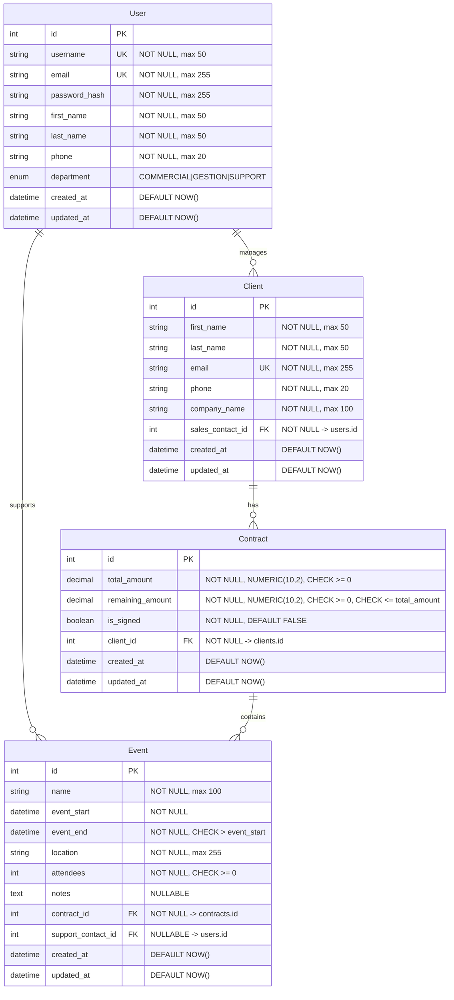

# Diagramme de Base de Données - Epic Events CRM

```mermaid
erDiagram
    User ||--o{ Client : manages
    User ||--o{ Event : supports
    Client ||--o{ Contract : has
    Contract ||--o{ Event : contains

    User {
        int id PK
        string username UK "NOT NULL, max 50"
        string email UK "NOT NULL, max 255"
        string password_hash "NOT NULL, max 255"
        string first_name "NOT NULL, max 50"
        string last_name "NOT NULL, max 50"
        string phone "NOT NULL, max 20"
        enum department "COMMERCIAL|GESTION|SUPPORT"
        datetime created_at "DEFAULT NOW()"
        datetime updated_at "DEFAULT NOW()"
    }

    Client {
        int id PK
        string first_name "NOT NULL, max 50"
        string last_name "NOT NULL, max 50"
        string email UK "NOT NULL, max 255"
        string phone "NOT NULL, max 20"
        string company_name "NOT NULL, max 100"
        int sales_contact_id FK "NOT NULL -> users.id"
        datetime created_at "DEFAULT NOW()"
        datetime updated_at "DEFAULT NOW()"
    }

    Contract {
        int id PK
        decimal total_amount "NOT NULL, NUMERIC(10,2), CHECK >= 0"
        decimal remaining_amount "NOT NULL, NUMERIC(10,2), CHECK >= 0, CHECK <= total_amount"
        boolean is_signed "NOT NULL, DEFAULT FALSE"
        int client_id FK "NOT NULL -> clients.id"
        datetime created_at "DEFAULT NOW()"
        datetime updated_at "DEFAULT NOW()"
    }

    Event {
        int id PK
        string name "NOT NULL, max 100"
        datetime event_start "NOT NULL"
        datetime event_end "NOT NULL, CHECK > event_start"
        string location "NOT NULL, max 255"
        int attendees "NOT NULL, CHECK >= 0"
        text notes "NULLABLE"
        int contract_id FK "NOT NULL -> contracts.id"
        int support_contact_id FK "NULLABLE -> users.id"
        datetime created_at "DEFAULT NOW()"
        datetime updated_at "DEFAULT NOW()"
    }
```
